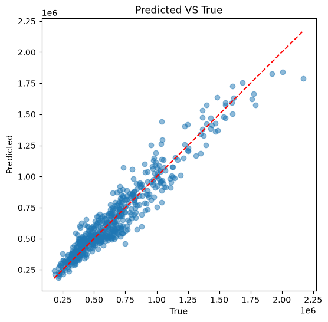
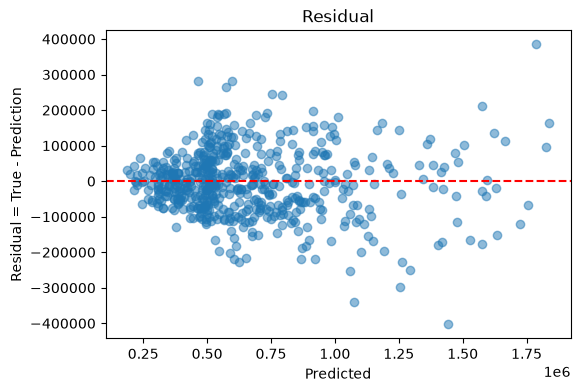
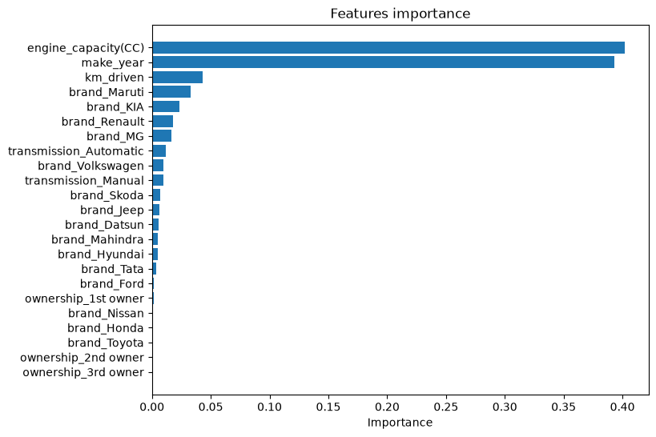

# Used Car Price Prediction 

A machine learning project that predicts the price of used cars
using **Scikit-learn**. The project covers the full ML workflow:
data loading, feature engineering, model comparison, hyperparameter
tuning, evaluation, and model persistence.

---

## Project Overview

The dataset contains information about pre-owned cars, including:

- Brand and model
- Transmission type (Manual / Automatic)
- Manufacturing year
- Fuel type
- Engine capacity (CC)
- Kilometers driven
- Ownership history

**Goal:** Build a regression model that predicts a car's price from its features.

---

## Dataset

- Source: [Kaggle — Cars India Pre-Owned](https://www.kaggle.com/datasets/mrmars1010/cars-india-pre-owned)
- File used in this project: `data/cleaned/cars.csv`
- Rows: 1 row = 1 used car listing
- Target variable: `price`

---

```
## Project Workflow
Raw CSV
↓
Data Cleaning (separate project)
↓
Feature Encoding (One-Hot)
↓
Train / Test Split (80 / 20)
↓
Feature Scaling (StandardScaler)
↓
Model Training & Comparison
↓
Hyperparameter Tuning (GridSearchCV)
↓
Final Evaluation
↓
Feature Importance Analysis
↓
Save Model (joblib)

```

---

## Models Compared

| Model                     | R² (Test) |
|---------------------------|-----------|
| Linear Regression         | 0.79      |
| Lasso                     | 0.78      |
| Ridge                     | 0.78      |
| Decision Tree Regressor   | 0.81      |
| K-Nearest Neighbors       | 0.80      |
| Random Forest Regressor   | 0.89      |
| Gradient Boosting (default)| 0.86     |
| **Gradient Boosting (tuned)** | **0.897** |

**Best model:** `GradientBoostingRegressor` after GridSearchCV.

Best hyperparameters found:

```
learning_rate = 0.05
max_depth = 4
min_samples_leaf = 1
min_samples_split= 2
n_estimators = 500
subsample = 0.8
```

---

## Evaluation Metrics

The final model was evaluated using:

- **MSE** — Mean Squared Error
- **MAE** — Mean Absolute Error
- **RMSE** — Root Mean Squared Error
- **R²** — Coefficient of Determination

---

## Feature Importance

Top features that influence car price:

1. `engine_capacity(CC)`
2. `make_year`
3. `km_driven`
4. `brand_Maruti`
5. `brand_KIA`

This matches intuition: newer cars with bigger engines and lower mileage
tend to be more expensive.

---

## Visualizations

The notebook includes:

- Predicted vs True price scatter plot
- Residual plot
- Feature importance bar chart

These help evaluate how well the model performs and where it makes errors.

---

## Project Structure

```
used_cars_ml/
│
├── data/
│ ├── raw/
│ └── cleaned/
│ └── cars.csv
│
├── models/
│ └── best_model.pkl
│
├── notebooks/
│ └── model.ipynb
│
├── graphics/
│
├── README.md
└── requirements.txt

```

---

## Requirements

Install the dependencies with:

```
pip install -r requirements.txt
```

Main libraries used:

- numpy

- pandas

- scikit-learn

- matplotlib

- joblib

How to Run
Clone the repository:

```
git clone https://github.com/compuser21/used_cars_ml.git
cd used_cars_ml
```
Install dependencies:

```
pip install -r requirements.txt
```
Open the notebook:

```
jupyter notebook notebooks/model.ipynb
```
Run the cells in order.

---

Key Learnings

- Compared several regression models on the same dataset.

- Used cross-validation to choose the best model fairly.

- Applied GridSearchCV to tune Gradient Boosting.

- Interpreted the model using feature importance.

- Saved the final model with joblib for reuse.

---

Future Improvements

- Add more features (fuel type, insurance, service history).

- Try XGBoost / LightGBM for better performance.

- Use log-transformed price to handle skewness.

- Deploy the model with Flask or Streamlit.

---

## Author
- Li Zhao (compuser21)
- Aspiring Data Analyst / ML Engineer
- Focus: Data Analysis, Machine Learning, and Real-world Data Projects
- [GitHub: @compuser21](https://github.com/compuser21)

---

## Visualizations

The following plots help evaluate the model's performance and understand
which features drive predictions.

### 1. Predicted vs True Prices

Points close to the red diagonal line indicate accurate predictions.
Most points cluster around the line, showing the model captures the
general price trend well.



---

### 2. Residual Plot

Residuals = True Price − Predicted Price.

A good model should have residuals randomly scattered around 0.
Any visible pattern suggests the model is missing some signal in the data.



---

### 3. Feature Importance

The bar chart below shows which features contribute the most to the
model's predictions.

Top features:
- `engine_capacity(CC)`
- `make_year`
- `km_driven`
- `brand_Maruti`
- `brand_KIA`


